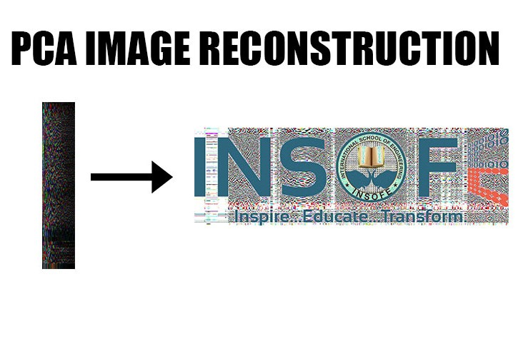

# Agenda

* Read in Image Data from jpeg source

* Separate the image channels

* Perform PCA on the individual channels

* Image Reconstruction through PCA transformation

* Render the Image

# Read in the Image Data

* We can read in Image data, here we use jpeg as the source (jpeg is to images, how csv is to spreadsheets)

* We can read in jpeg data by using the readJPEG() function from the "jpeg" package available through CRAN??

```{r}


setwd("C:/Users/kiran/Desktop/INSOFE/20170702-batch29-cse7302c-regularizpcanb-kirankumarpatro-master/PCA")

library(jpeg)

ins_img <- readJPEG("insofe.jpg")

```

* Let's now look at the structure of "ins_img"


```{r}

str(ins_img)

```

* There are three colour channels (Red, Green and Blue) of 640x2048 resolution

* The is.array() function helps us verify if any R object happens to be an array 

```{r}

is.array(ins_img)

```

* From the output above we can see that the image data we read in is an array

* So, what is an array? Well, it is a collection of homogenous data types in R, in the one dimensional case we call it a vector, in the two dimensional case we call it a matrix, for higher dimensions we call it, you guessed it right, an ARRAY

* Great Job! We have successfully read in image data so that R understands it

# Separating the RGB Channels

* To successfully use the prcomp() function, we first have to separate the three image channels

* Subsetting arrays is similar to subsetting matrices and dataframes, we use the index of the dimension we want to extract

```{r}

# Red colour channel

img_r <- ins_img[ , , 1]

# Green colour channel

img_g <- ins_img[ , , 2]

# Blue colour channel

img_b <- ins_img[ , , 3]

```

# Principal Components of the Image data

* Let's use the prcomp() function to get the principal components of the image data

```{r}

pca_ins_r <- prcomp(img_r, center = F)

pca_ins_g <- prcomp(img_g, center = F)

pca_ins_b <- prcomp(img_b, center = F)


```

# Image Reconstruction

* Select the number of pixels you want to retain out of the 640 pixels in the height dimension

```{r}

pxl <- 125

```

* The pca object we created earlier, has the "x" (original data points) and "rotation" (eigenvectors of the covariance matrix) objects

- Now, we use the matrix multiplication operator "%*%" and reconstruct the image from reduced pixels 

```{r}

ins_reconst_r <- pca_ins_r$x[,1:pxl] %*% t(pca_ins_r$rotation[,1:pxl])

ins_reconst_g <- pca_ins_g$x[,1:pxl] %*% t(pca_ins_g$rotation[,1:pxl])

ins_reconst_b <- pca_ins_b$x[,1:pxl] %*% t(pca_ins_b$rotation[,1:pxl])

```


* Let's use the simplify2array() function to combine all the three vectors into a 3 dimensional array and form our reconstructed image

```{r}

# the first argument is a list of arrays you want to combine, the "higher = T" argument tells the function to combine the arrays in the higher dimension

ins_reconst <- simplify2array(list(ins_reconst_r, ins_reconst_g, ins_reconst_b), higher = T)

```

* Let's also see how the image looks like with the selected pixels, let's store it in the variable "cat_comp"

```{r}

ins_comp <- simplify2array(list(pca_ins_r$x[,1:pxl], pca_ins_g$x[,1:pxl], pca_ins_b$x[,1:pxl]), higher = T)

```

# Render the images

* We can save the images back in the jpeg file to the disk, by calling the writeJPEG() function from the jpeg package

```{r}

writeJPEG(ins_reconst, "ins_reconst.jpeg")

writeJPEG(ins_comp, "ins_comp.jpeg")

```


- __From the output above, we can see that the non varying part of the image (the white background) isn't restored properly. But the varying part is restored very well.__




# Conclusion

* PCA is constantly used in many areas where there is extremely high dimensional data, such as network intrusion detection, to simplify the dataset but still capture the variance in the dataset with minimal information loss.


# Assignment

1) Try out the PCA image reconstruction on a few different images

2) Describe what you observed and what you understand by PCA in a paragraph

```{r}


### Complete the assignment here
 setwd("G:/INSOFE/20170702-batch29-cse7302c-regularizpcanb-kirankumarpatro-master/PCA")

library(jpeg)

ins_img <- readJPEG("delllogo.jpg")

```

```{r}
str(ins_img)
```

```{r}
is.array(ins_img)
```

```{r}
# Red colour channel

img_r <- ins_img[ , , 1]

# Green colour channel

img_g <- ins_img[ , , 2]

# Blue colour channel

img_b <- ins_img[ , , 3]
```


```{r}
pca_ins_r <- prcomp(img_r, center = F)

pca_ins_g <- prcomp(img_g, center = F)

pca_ins_b <- prcomp(img_b, center = F)
```


```{r}
pxl <- 30
```

```{r}
ins_reconst_r <- pca_ins_r$x[,1:pxl] %*% t(pca_ins_r$rotation[,1:pxl])

ins_reconst_g <- pca_ins_g$x[,1:pxl] %*% t(pca_ins_g$rotation[,1:pxl])

ins_reconst_b <- pca_ins_b$x[,1:pxl] %*% t(pca_ins_b$rotation[,1:pxl])
```

```{r}
ins_reconst <- simplify2array(list(ins_reconst_r, ins_reconst_g, ins_reconst_b), higher = T)
```


```{r}
ins_comp <- simplify2array(list(pca_ins_r$x[,1:pxl], pca_ins_g$x[,1:pxl], pca_ins_b$x[,1:pxl]), higher = T)
```

```{r}
writeJPEG(ins_reconst, "ins_reconst.jpeg")

writeJPEG(ins_comp, "ins_comp.jpeg")
```


